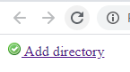

# fam-css

Kudos to [famfamfam](http://www.famfamfam.com/) for creating simple yet beautiful icons. 

### Install

```
$ bower install iescarro/fam-css --save
```

### Usage

```html
<link rel="stylesheet" href="bower_components/fam-css/css/fam.css">

<!-- sample -->
<a href="#"><i class="fam fam-accept"></i> Add directory</a>
```



Icons are prefixed with fam. See img directory for all famfamfam icons.

## Contribute

See https://github.com/iescarro/fam-css/issues

## Donate

[](https://www.buymeacoffee.com/iescarro)
